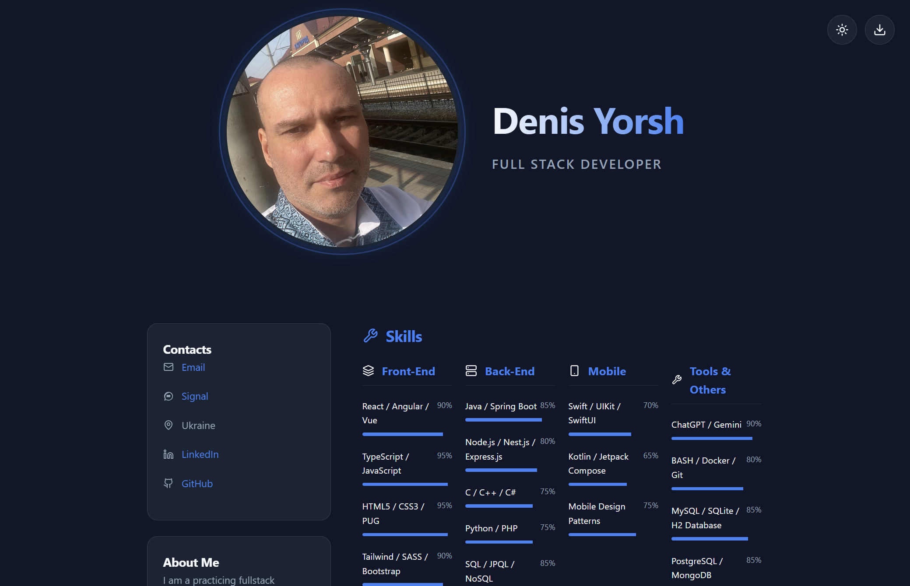
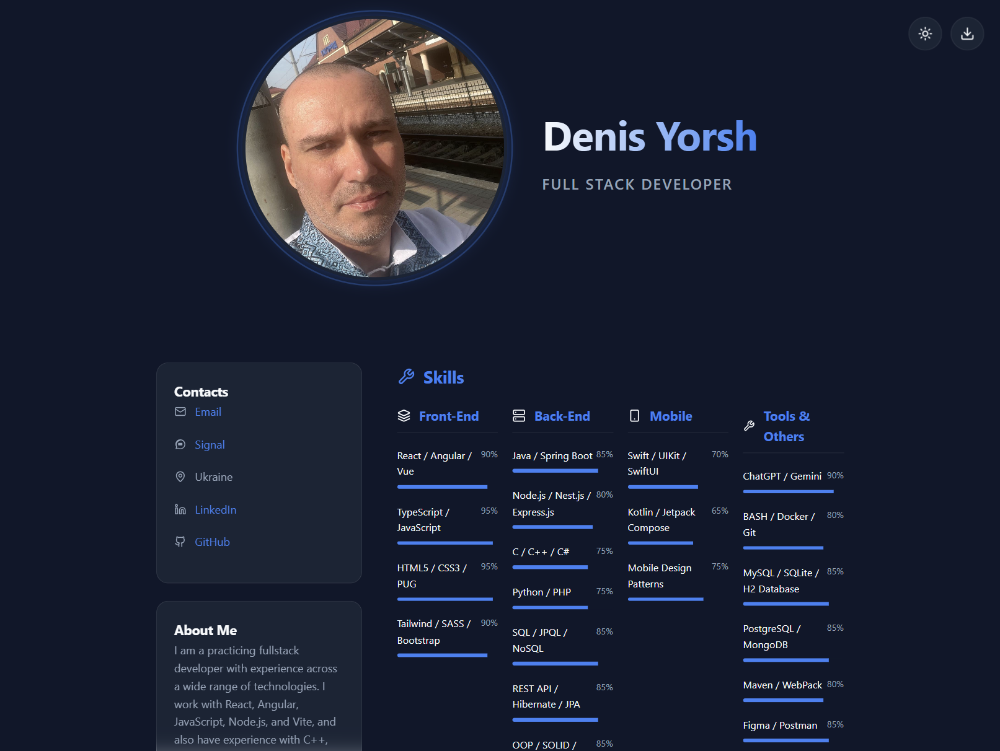
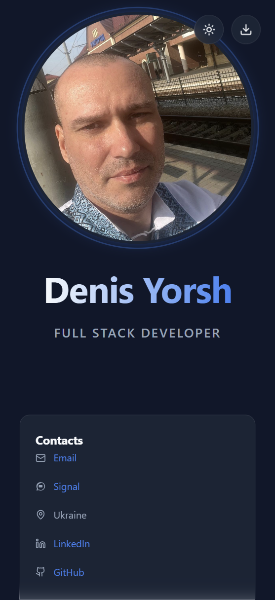

# Full Stack Developer (React) - Resume

## Author

- **Denys Yorsh** — *Lead Developer*
- **Gemini (Google AI)** — *AI Pair Programming & Architecture Assistant*

## Technologies used:

- React
- TypeScript
- Vite

---

### Desctop

### Tablet

### Mobile

---

### How to launch

1. **Launch the terminal** in the project folder.
   

2. **Run the command** in the terminal: `npm run dev`
   

3. **Open the link**: Press `Ctrl + Click` on the link or open it in your browser.
   

---

## Thank you for your attention!
